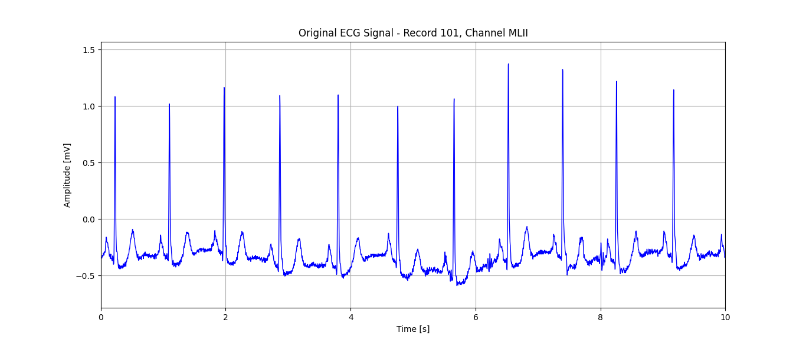
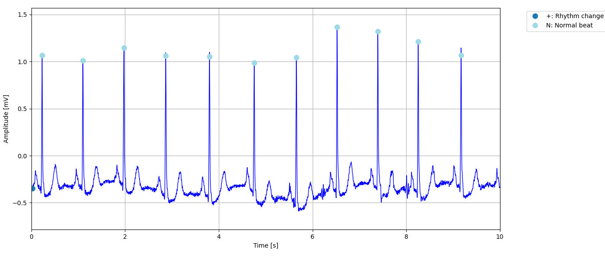
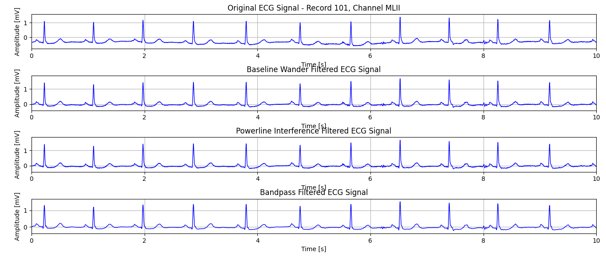
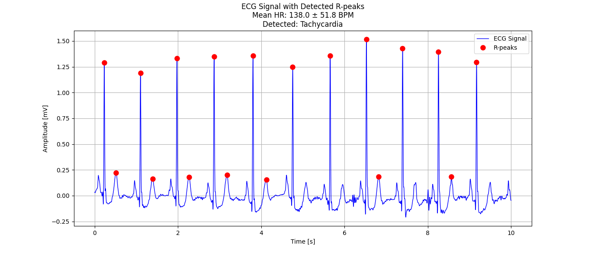
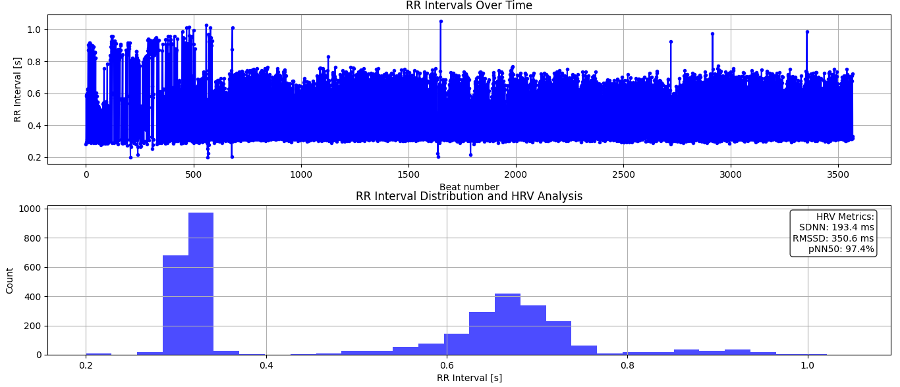
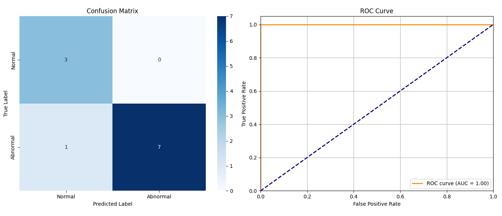

# ECG Signal Processing and Analysis Documentation

## Table of Contents
1. [Project Overview](#project-overview)
2. [Code Structure](#code-structure)
3. [Module Details](#module-details)
4. [Usage Examples](#usage-examples)
5. [Machine Learning Integration](#machine-learning-integration)
6. [Sample Outputs](#sample-outputs)

## Project Overview

This project implements a comprehensive ECG signal processing and analysis system using Python. It includes functionality for:
- Loading and handling ECG data from the MIT-BIH database
- Signal processing and filtering
- R-peak detection and heart rate analysis
- Machine learning-based ECG abnormality detection
- Visualization tools for ECG analysis

## Code Structure

The project consists of four main Python modules:

1. `ecg_metadata.py`: Handles data loading and basic visualization
2. `ecg_processing.py`: Implements signal processing functions
3. `ecg_Rcalculations.py`: Provides R-peak detection and heart rate analysis
4. `ecg_ML.py`: Implements machine learning functionality
5. `ecg_example.py`: Contains example usage and demonstration code

## Module Details

### 1. ecg_metadata.py

#### Key Classes:
```python
@dataclass
class ECGMetadata:
    record_id: str
    sampling_frequency: int
    channel_names: List[str]
    duration: float
    num_samples: int
    signal_data: np.ndarray

@dataclass
class AnnotationData:
    sample_points: np.ndarray
    symbols: np.ndarray
    descriptions: Dict[str, str]
```

#### Main Functions:
- `load_ecg_data()`: Loads ECG records from the MIT-BIH database
- `extract_annotations()`: Extracts and processes annotation data
- `plot_ecg_segment()`: Visualizes ECG segments
- `plot_ecg_with_annotations()`: Visualizes ECG with annotations

### 2. ecg_processing.py

#### Signal Processing Functions:
- `remove_baseline_wander()`: Removes low-frequency baseline drift
- `remove_powerline_interference()`: Removes 50/60 Hz power line interference
- `apply_bandpass_filter()`: Applies bandpass filtering for noise reduction

### 3. ecg_Rcalculations.py

#### Key Classes:
```python
@dataclass
class RPeakData:
    peak_indices: np.ndarray
    peak_amplitudes: np.ndarray
    rr_intervals: np.ndarray
    mean_hr: float
    std_hr: float
    hrv_metrics: Dict[str, float]
    abnormalities: Dict[str, bool]
```

#### Main Functions:
- `detect_r_peaks()`: Detects R-peaks in ECG signal
- `calculate_hrv_metrics()`: Calculates heart rate variability metrics
- `detect_abnormalities()`: Identifies potential cardiac abnormalities
- `plot_ecg_with_peaks()`: Visualizes ECG with detected R-peaks
- `plot_rr_intervals()`: Visualizes RR intervals and HRV analysis

### 4. ecg_ML.py

#### Machine Learning Functions:
- `process_training_records()`: Processes records for ML training
- `prepare_ml_features()`: Prepares features for ML model
- `train_ml_model()`: Trains logistic regression model
- `test_ml_model()`: Tests and evaluates ML model performance

## Usage Examples

### Basic ECG Loading and Visualization
```python
from ecg_metadata import load_ecg_data, plot_ecg_segment

# Load a single record
record = load_ecg_data('101')

# Plot a 10-second segment
plot_ecg_segment(record, 'MLII', start_time=0, duration=10)
```

### Signal Processing Pipeline
```python
from ecg_processing import (
    remove_baseline_wander,
    remove_powerline_interference,
    apply_bandpass_filter
)

# Apply filtering pipeline
baseline_filtered = remove_baseline_wander(record)
powerline_filtered = remove_powerline_interference(baseline_filtered)
clean_signal = apply_bandpass_filter(powerline_filtered)
```

### R-peak Detection and Analysis
```python
from ecg_Rcalculations import detect_r_peaks, plot_ecg_with_peaks

# Detect R-peaks
r_peaks = detect_r_peaks(clean_signal)

# Visualize results
plot_ecg_with_peaks(clean_signal, 'MLII', r_peaks)
```

## Sample Outputs

### 1. Original ECG Signal

- Shows raw ECG signal from MIT-BIH database
  
### 2. Annotated Original Signal

- Displays the annotated ECG signal with labeled annotations

### 3. Filtered Signal

- Demonstrates the effect of filtering pipeline

### 4. R-peak Detection

- Shows detected R-peaks and calculated heart rate

### 5. Heart Rate Variability Analysis

- Displays RR intervals and HRV metrics

### 5. Machine Learning Results

```
Detailed Classification Analysis:
==================================================

1. Overall Performance Metrics:
------------------------------
Accuracy:     0.909
F1 Score:     0.933
Precision:    1.000
Recall:       0.875

2. Error Analysis:
------------------------------
False Positive Rate: 0.000
False Negative Rate: 0.125
Number of False Positives: 0
Number of False Negatives: 1

3. Detailed Misclassification Analysis:
--------------------------------------------------

Misclassified Records:
Record ID | True Label | Predicted | Confidence | Abnormalities
---------------------------------------------------------------------------
223      | Abnormal   | Normal    | 0.598     | tachycardia
```

#### Visualization Plots

##### 1. Confusion Matrix and ROC Curve

- Shows true/false positives and negatives to evaluate classification accuracy.
- Displays model’s sensitivity vs. specificity.

## Machine Learning Integration

The project includes machine learning capabilities for automated ECG analysis:

1. Feature Extraction:
   - Heart rate statistics
   - HRV metrics
   - RR interval patterns

2. Model Training:
   - Uses Logistic Regression
   - Performance metrics calculation

3. Abnormality Detection:
   - Bradycardia
   - Tachycardia
   

## Notes

- The project uses the MIT-BIH Arrhythmia Database
- Sampling frequency: 360 Hz
- Primary analysis channel: MLII
- Supports both single and multi-record processing 
